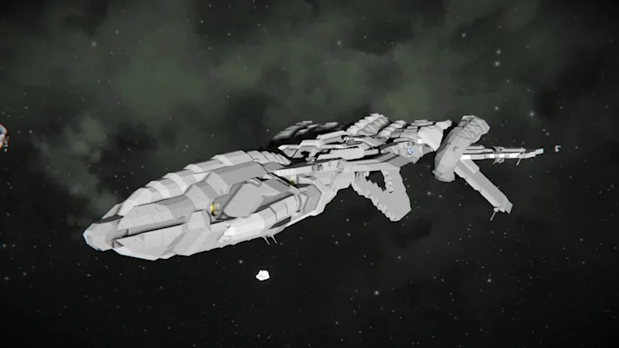
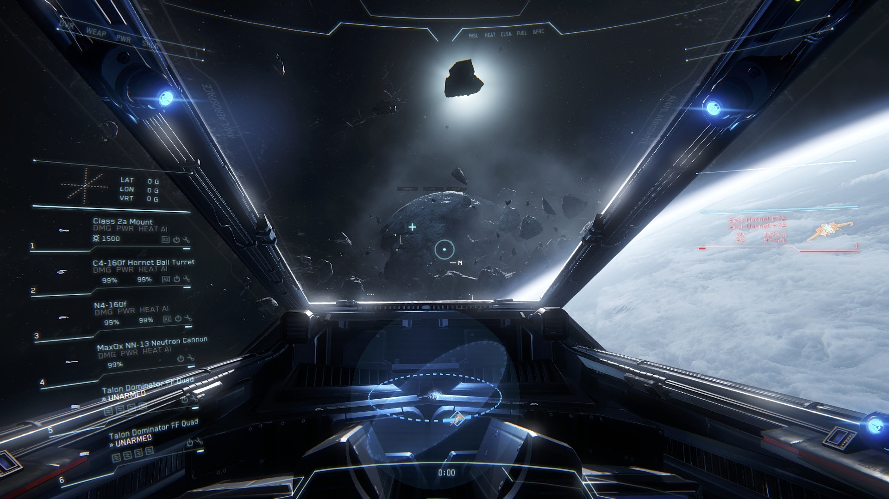
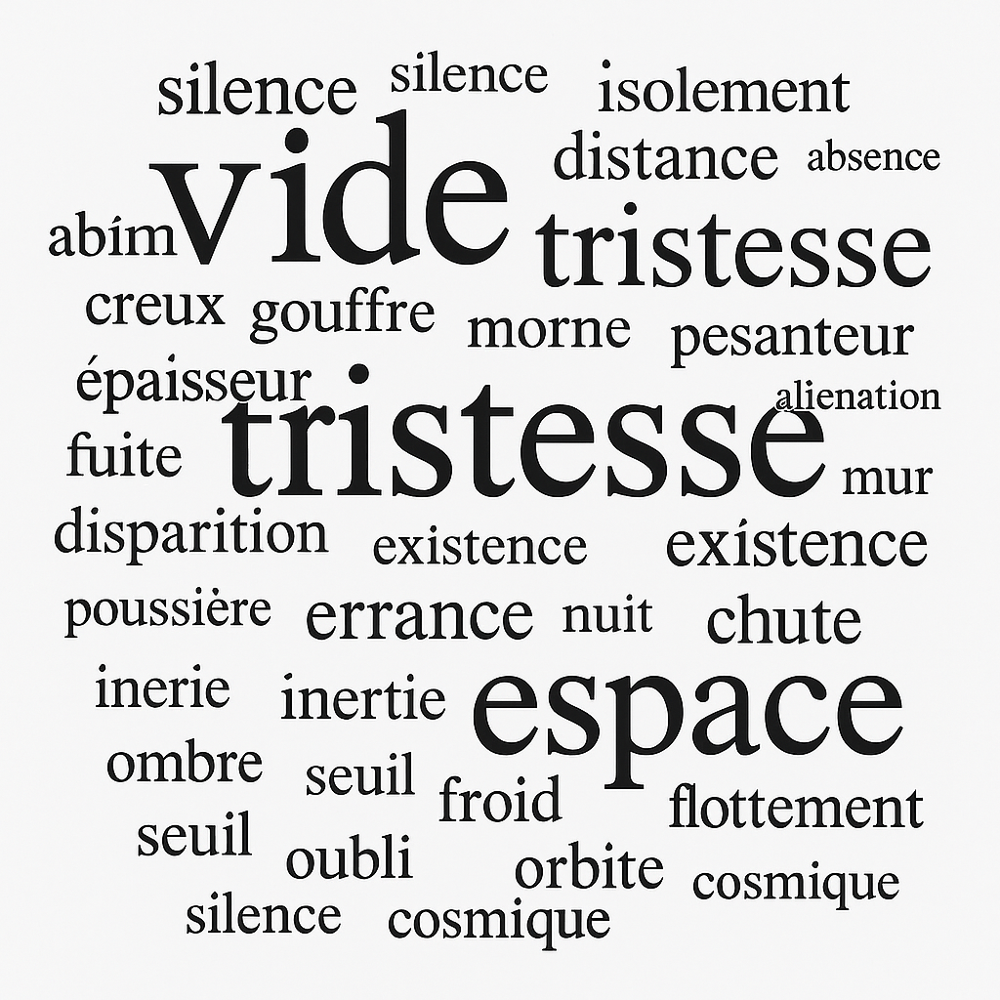

# Brainstorming

→ Roguelike 

→ NPCs

→Bonus après les vagues

→ Voxels marching cubes : [https://fr.wikipedia.org/wiki/Marching_cubes](https://fr.wikipedia.org/wiki/Marching_cubes)

→ Tirs 

→ Première personne 

→ Ange gardien → explique comment jouer, mais n’aide pas réelement 

→ Dans l’espace → Montrer le vide et le froid qui nous entoure dans la vie

→ Champs d’asteroides → Possibilités de naviguer à travers certains astéroïdes 

→ Charges sismiques (arme)

→ Différents astéroïdes 

→ vagues infinies → plus on tue d’ennemis plus on a des outils → montre qu’on se développe dans l’adversité

→ vagues infinies → absurdité de la lutte, confusion existentielle

→ Entre les vagues, explications du contexte de cette guerre.

**L’adversité, solitude = réisilience -> stoischme**

Anxiété : couleur adaptée → noir

Pablo Picasso, durant sa « période bleue », **a intensément exploré les nuances émotionnelles du bleu**. Dans « La Vie », les différentes teintes suscitent tristesse et contemplation. Ce monochrome du bleu amplifie l’impact émotionnel de ses sujets, souvent des personnes marginalisées ou en détresse.

regarder Spaceman

Objectif : Fatalisme

Asset spaceship : [https://assetstore.unity.com/packages/3d/vehicles/space/destructor-spaceship-3229](https://assetstore.unity.com/packages/3d/vehicles/space/destructor-spaceship-3229)

 [https://assetstore.unity.com/packages/3d/vehicles/space/star-sparrow-modular-spaceship-73167](https://assetstore.unity.com/packages/3d/vehicles/space/star-sparrow-modular-spaceship-73167)

lowpoly : [https://assetstore.unity.com/packages/3d/environments/sci-fi/lowpoly-spaceship-183012](https://assetstore.unity.com/packages/3d/environments/sci-fi/lowpoly-spaceship-183012)

